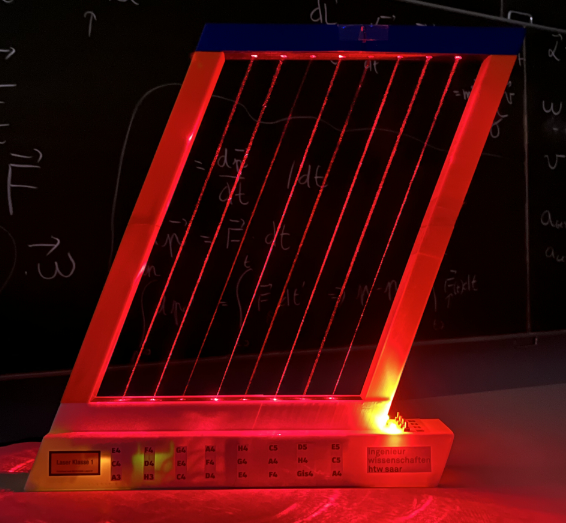

# 🎵 Arduino Laser Harp

## Mechatronics & Sensor Technology Project

An interdisciplinary mechatronics project focused on the development of an eight-string, contactless Laser Harp.

The system combines optics, electronics, sensor technology, embedded programming and MIDI communication. Laser beams are directed onto LDR (Light Dependent Resistor) sensors. When a laser beam is interrupted, the resulting change in the sensor signal is detected by an Arduino Mega 2560 and converted into a corresponding MIDI note.

---

## 📌 Project Overview

The goal of the project was to design and build a functional Laser Harp that converts physical interaction with laser beams into digital musical signals.

The system consists of eight laser beams and eight LDR sensors. Each laser beam represents one string of the instrument. When a beam is interrupted, the corresponding change in light intensity is detected by the LDR sensor.

The Arduino processes the sensor signals, determines which string has been interrupted and generates the corresponding MIDI Note On or Note Off message. The MIDI signal can then be processed by a computer-based synthesizer or DAW.

The project combines:

- Physics and optics
- Electronics
- Sensor technology
- Embedded programming
- Signal processing
- MIDI communication
- Mechanical design and CAD

---

## ⚙️ Hardware

The main hardware components include:

- Arduino Mega 2560
- 8 × laser modules
- 8 × LDR sensors
- BC337 transistor
- Push buttons
- Status LEDs
- 9 V DC power supply
- Custom electronic wiring
- 3D-printed housing

The project also involved the analysis and optimization of the power supply, transistor selection, grounding concept and sensor stability. :contentReference[oaicite:2]{index=2}

---

## 💻 Software

The Arduino software was structured into separate components for:

- Hardware I/O
- System state management
- Sensor calibration
- Scale selection
- Laser control
- Sensor signal processing
- MIDI note generation

The system supports three predefined musical scales and uses eight sensor channels corresponding to the eight laser strings. :contentReference[oaicite:3]{index=3}

A hysteresis-based detection algorithm is used to prevent unwanted note flickering when the laser beam is only partially interrupted. :contentReference[oaicite:4]{index=4}

### Source Code

➡️ **[View the Arduino Source Code](Code/sketch_dec1b.ino)**

---

## 🧪 Testing & Validation

The project included systematic electrical measurements, troubleshooting and functional testing.

Among other aspects, the team investigated:

- Power supply stability
- Voltage drops
- Grounding
- Transistor switching
- Laser voltage
- Sensor reliability
- Laser safety

A star-grounding topology was implemented to separate high-current laser loads from the sensitive sensor measurement circuitry. :contentReference[oaicite:5]{index=5}

The final prototype successfully achieved the project objectives and demonstrated a functional eight-string Laser Harp. :contentReference[oaicite:6]{index=6}

---

## 🛠️ Mechanical Design

The mechanical development progressed through several prototypes.

The first prototype was used to validate the basic laser/LDR detection principle. The second prototype expanded the system to eight strings and was mounted on a wooden plate.

The final design used a framed housing to provide stable alignment between the lasers and sensors and to protect the electronics. :contentReference[oaicite:7]{index=7}

---

## 👨‍🔧 My Contribution

My main contribution to the project focused on the **electronics and sensor system**.

My work was particularly related to:

- Electronic circuit implementation
- LDR-based sensor detection
- Hardware integration
- Interaction between sensors and the Arduino
- Testing and troubleshooting

The project was developed as a team project together with Ahmad Berkel and Majd Hagig. :contentReference[oaicite:8]{index=8}

---

## 📄 Documentation

The complete project documentation covers the theoretical background, hardware development, software implementation, MIDI integration, mechanical design, testing, troubleshooting and project results.

➡️ **[Read the Complete Project Documentation](Documentation_v1-5.pdf)**

---

## 🎥 Video Demonstration

➡️ **[Watch the Laser Harp Demonstration](https://youtu.be/LRuz3PJn_Mw)**

---

## 🎓 Project Context

**Program:** Mechatronics & Sensor Technology  
**Institution:** Hochschule für Technik und Wirtschaft des Saarlandes (htw saar)  
**Course:** Physics 3  
**Project:** Arduino Laser Harp  
**Project Number:** 2025-LH-001  
**Year:** 2026

---

## 🚀 Future Development

Possible future improvements described in the project documentation include:

- Adding an ultrasonic sensor for dynamic control of note velocity
- Developing a standalone version using a Raspberry Pi
- Integrating a software synthesizer directly into the instrument

These concepts would make the Laser Harp more expressive and potentially usable as a standalone musical instrument. :contentReference[oaicite:9]{index=9}
